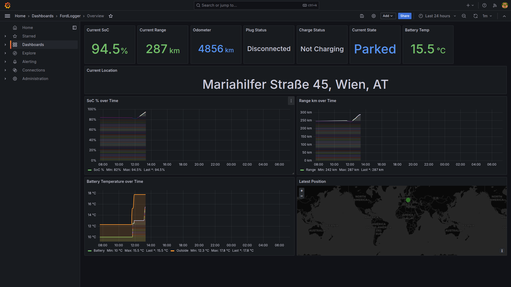
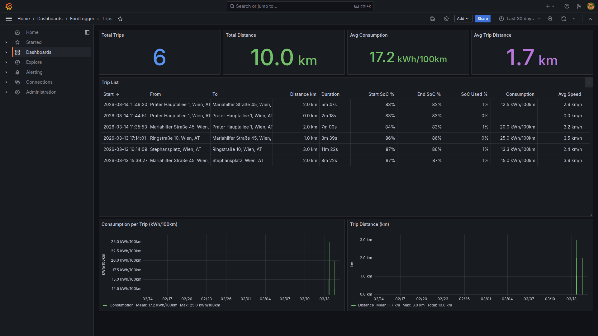

# FordLogger

Self-hosted vehicle data logger for Ford vehicles. Inspired by [TeslaLogger](https://github.com/bassmaster187/TeslaLogger).

Continuously polls the FordConnect API, stores telemetry in PostgreSQL, detects trips and charge sessions automatically, and visualizes everything in Grafana dashboards.

## API: EU Data Act — not a reverse-engineered hack

FordLogger uses Ford's **official FordConnect Query API**, provided under the [EU Data Act](https://developer.ford.com/developer-eu). This is fundamentally different from tools that reverse-engineer the FordPass mobile app API:

- **Official and supported** — Ford is legally required to provide this API under EU regulation
- **Stable** — Won't break when Ford updates their mobile app
- **EU customers only** — The API is currently available through Ford's EU developer portal. It may not work for vehicles registered outside the EU.

## Tested vehicles

Currently tested with the **Ford Puma Gen-E (2025)** and **Ford Explorer (2024)**. It should work with other FordConnect-enabled vehicles, including ICE (petrol/diesel) models — the telemetry endpoints are the same. However, some dashboards (Charging, Consumption, Battery Degradation) are designed for EVs and would need adaptation for ICE vehicles.

**If you have a different Ford model, I'd love to hear from you!** Especially if you can test with ICE vehicles — see [Contributing](#contributing).

## Features

- **Adaptive polling** — 60s while driving/charging, 2min parked, 5min sleeping
- **Vehicle state machine** — Automatically detects driving, charging, parked, and sleeping states
- **Trip detection** — Records distance, consumption (kWh/100km), speeds, SoC used
- **Charge session detection** — Records energy added, max/avg power, AC/DC classification
- **7 Grafana dashboards** — Overview, Trips, Charging, Consumption, Battery Degradation, GPS Map, Timeline
- **Full telemetry storage** — Raw JSON preserved for future-proofing
- **Multi-vehicle support** — Multiple cars in one account, switchable via dashboard dropdown
- **Docker Compose deployment** — One command to run everything

## Requirements

FordLogger needs to run **24/7** to capture all trips and charge sessions (it polls the API, there are no push notifications). Minimal resources: ~256 MB RAM, any CPU, less than 1 GB disk (grows slowly with data).

**Recommended setups:**

| Setup | Notes |
|-------|-------|
| **Raspberry Pi 4/5** | Sweet spot for most users. Low power (~5W), cheap, runs 24/7. Pi 3 may be tight on RAM with Grafana. |
| **Home server / NAS** | Ideal if you already have one (Synology, Unraid, TrueNAS, or a plain Linux box with Docker). |
| **Proxmox LXC/VM** | Clean option for homelab users. A lightweight LXC container with Docker is enough. |
| **Cloud VPS** | Works but overkill for a single car. Cheapest Hetzner or Oracle free tier would do it. |

**Operating system:** Developed and tested on **Linux** (Debian/Ubuntu). macOS and Windows should work via Docker Desktop / WSL2, but this is untested.

## Prerequisites: FordConnect API Setup

Before you can use FordLogger, you need API credentials from Ford's developer portal.

### 1. Create a Ford Developer account

Go to [https://developer.ford.com/developer-eu](https://developer.ford.com/developer-eu) and create an account. **You must use the same email address that you use in the FordPass app** — Ford links API access to your FordPass account. Fill out every field in the registration form completely and use only standard English characters (a–z, 0–9) — special characters and incomplete fields have been reported to cause errors.

### 2. Create an application

1. Log in to the developer portal and create a new application
2. Set the **Redirect URI** to `http://localhost:8080/callback`
3. Once created, copy the **Client ID** and **Client Secret**

### 3. Wait for backend provisioning

After creating your app, Ford's backend may need some time (minutes to hours) to fully provision your credentials. If authentication fails immediately after setup, wait a bit and try again.

## Quick Start

### 1. Clone and configure

```bash
git clone https://github.com/lutzerb/fordlogger.git
cd fordlogger
cp config.example.json config.json
```

Edit `config.json` and paste your **Client ID** and **Client Secret**:

```json
{
  "client_id": "your-client-id-from-ford-developer-portal",
  "client_secret": "your-client-secret-from-ford-developer-portal",
  "redirect_uri": "http://localhost:8080/callback"
}
```

### 2. Authenticate

```bash
docker compose run -p 8080:8080 fordlogger python -m fordlogger --auth
```

This prints a URL. Open it in your browser, log in with your **FordPass credentials**, and authorize the app. Ford redirects back to `localhost:8080/callback`, where FordLogger captures the auth code and exchanges it for tokens (saved to `tokens.json`).

**Running on a remote server?** The OAuth callback must reach the FordLogger container on port 8080. If your browser is on a different machine than Docker, set up an SSH tunnel:

```bash
# On your local machine — forwards localhost:8080 to the server
ssh -L 8080:localhost:8080 your-server
```

Then open the auth URL in your local browser. The callback will go to your local `localhost:8080`, which the tunnel forwards to the server where FordLogger is listening.

### 3. Run

```bash
docker compose up -d
```

This starts:
- **fordlogger** — Polling daemon with adaptive intervals
- **PostgreSQL 16** — Telemetry database
- **Grafana 11** — Dashboards at [http://localhost:3000](http://localhost:3000) (login: `admin` / `fordlogger`)

### 4. Verify

```bash
# Single poll (test without daemon)
docker compose run fordlogger python -m fordlogger --once

# Check logs
docker compose logs -f fordlogger
```

## Dashboards

| Dashboard | Description |
|-----------|-------------|
| **Overview** | Current SoC, range, odometer, plug status, location map |
| **Trips** | Trip history with distance, consumption, duration |
| **Charging** | Charge sessions with energy added, power curves |
| **Consumption** | kWh/100km per trip, vs temperature, vs speed, monthly trends |
| **Degradation** | Battery capacity trend, SoC vs range scatter |
| **Map** | GPS tracks with per-trip coloring and start/end markers |
| **Timeline** | Vehicle state history (driving/charging/parked/sleeping) |
| **Raw Data** | Browse all telemetry, trips, charges, and raw API responses |

**Overview** — Live vehicle status at a glance: current SoC, range, odometer, plug/charge status, vehicle state, and battery temperature. Time series charts show SoC and range over time, battery vs outside temperature, and the car's last known position on a map.



**Trips** — Every drive logged automatically with distance, duration, SoC used, energy consumption (kWh/100km), average and max speed, and outside temperature. The consumption and distance charts show trends over time.



## Architecture

```
fordlogger/
├── fordlogger/              # Python package
│   ├── main.py              # CLI entry point (--auth, --once, daemon)
│   ├── config.py            # Config loading, polling intervals
│   ├── auth.py              # OAuth2 flow
│   ├── api.py               # FordConnect API client + telemetry parser
│   ├── db.py                # PostgreSQL operations
│   ├── models.py            # Dataclasses (Vehicle, Position, Trip, ChargeSession)
│   ├── state_machine.py     # Vehicle state transitions
│   ├── poller.py            # Adaptive polling loop
│   ├── trip_detector.py     # Trip boundary detection & summarization
│   └── charge_detector.py   # Charge session detection & summarization
├── sql/schema.sql           # PostgreSQL schema
├── grafana/                 # Dashboard JSON + provisioning
├── tests/                   # 77 tests (unit + live API)
├── docker-compose.yml
├── Dockerfile
└── config.example.json
```

### State Machine

```
                ┌──────────┐
        ┌──────►│ SLEEPING │◄──────┐
        │       └────┬─────┘       │
        │            │ activity    │
  no change for      │ detected   │
  30 min             │             │
        │       ┌────▼─────┐       │
        ├───────┤  PARKED  ├───────┤
        │       └──┬────┬──┘       │
        │   speed>0│    │plug+     │
        │          │    │charging  │
        │    ┌─────▼┐ ┌▼────────┐ │
        │    │DRIVING│ │CHARGING │ │
        │    └─────┬┘ └┬────────┘ │
        │   speed=0│   │complete/ │
        │          │   │unplug    │
        └──────────┘   └──────────┘
```

### Database Tables

- **`vehicles`** — One row per VIN
- **`positions`** — High-frequency telemetry snapshots (every poll)
- **`trips`** — Summarized drives (distance, consumption, speeds)
- **`charge_sessions`** — Summarized charges (energy, power, AC/DC)
- **`states`** — State transition log

## Local Development

```bash
python3 -m venv venv && source venv/bin/activate
pip install -r requirements.txt
pip install pytest

# Start PostgreSQL
docker compose up -d db

# Run with local DB
FORDLOGGER_DB_HOST=localhost python3 -m fordlogger --once

# Run tests
FORDLOGGER_DB_HOST=localhost python3 -m pytest tests/ --ignore=tests/test_live_api.py -v
```

## Configuration

| Key | Default | Description |
|-----|---------|-------------|
| `client_id` | — | FordConnect OAuth client ID |
| `client_secret` | — | FordConnect OAuth client secret |
| `redirect_uri` | `http://localhost:8080/callback` | OAuth callback URL |
| `db_host` | `db` | PostgreSQL host (`db` for Docker, `localhost` for local) |
| `db_port` | `5432` | PostgreSQL port |
| `db_name` | `fordlogger` | Database name |
| `db_user` | `fordlogger` | Database user |
| `db_password` | `fordlogger` | Database password |
| `sleep_after_minutes` | `30` | Minutes of inactivity before entering sleep state |

Environment overrides: `FORDLOGGER_DB_HOST`, `FORDLOGGER_DB_PORT`

## Backup & Restore

```bash
# Backup
./backup.sh                     # Creates fordlogger_backup_YYYYMMDD_HHMMSS.sql.gz
./backup.sh /path/to/backups    # Specify output directory

# Restore
gunzip -c fordlogger_backup_*.sql.gz | docker exec -i fordlogger-db-1 psql -U fordlogger fordlogger
```

The PostgreSQL data lives in a Docker named volume (`pgdata`). It survives `docker compose down` but **not** `docker compose down -v`. Back up regularly.

## FordConnect API

Uses Ford's FordConnect Query API (`fcon-query/v1`), the same API used by [evcc](https://github.com/evcc-io/evcc).

- Auth: `fcon-public/v1/auth/init` (OAuth2 authorization code flow)
- Endpoints: `/garage`, `/telemetry`
- Rate limits: ~1 request per minute (adaptive polling respects this)
- Access tokens expire in 20 minutes (auto-refreshed)
- Refresh tokens expire in 90 days

## Known Issues

- **Max speed per trip is unreliable** — The Ford API updates the speed value infrequently (~every 60s). Since FordLogger only sees snapshots, it often misses the actual top speed. The recorded max speed tends to be too low, especially on short trips. Longer highway drives may be more accurate, but this hasn't been verified yet.
- **Short trips may be missed** — If a trip starts and ends between two polling cycles (e.g. moving the car in a parking lot), it won't be recorded. The parked polling interval is 2 minutes.
- **Distance and consumption rounding** — Trip distance is calculated from odometer readings which Ford rounds to whole kilometers. Short trips may show 0 km distance and no consumption.

## Troubleshooting

**429 Too Many Requests**
Ford's API allows ~1 request per minute. FordLogger retries automatically with backoff (30s, 60s, 120s). If you see persistent 429 errors after a fresh start, wait a few minutes — it resolves itself.

**OAuth callback timeout ("No auth code received within 120s")**
The auth flow opens a local HTTP server on port 8080 and waits for Ford to redirect your browser back to it. This times out if:
- Your browser is on a different machine than where Docker is running — use an SSH tunnel: `ssh -L 8080:localhost:8080 your-server`, then open the auth URL in your local browser
- Port 8080 is already in use or blocked by a firewall — free the port or adjust your firewall rules
- You took more than 120 seconds to log in and authorize in the browser — just re-run the auth command

**Authentication fails immediately after creating API credentials**
Ford's backend may need time to provision new app credentials. Wait 15-30 minutes and try again.

**OAuth callback not reachable on remote server**
The auth flow starts a local HTTP server on port 8080. If Docker runs on a remote server but your browser is local, use an SSH tunnel: `ssh -L 8080:localhost:8080 your-server`

**No new data points appearing**
When the car is parked with ignition off, Ford's API returns stale data with the same timestamp. FordLogger skips duplicate data, so no new rows are inserted until the car wakes up (door open, ignition on, charging starts). Check `docker compose logs -f fordlogger` to verify the poller is running.

**Refresh token expired (90 days)**
Re-run the auth flow: `docker compose run -p 8080:8080 fordlogger python -m fordlogger --auth`

**Database connection lost**
FordLogger automatically reconnects to PostgreSQL if the connection drops. Check `docker compose logs fordlogger` for reconnection messages.

**Some trip fields are empty (consumption, avg speed, outside temp)**
These values are calculated from metrics that not all Ford vehicles report. To check what your vehicle actually sends, use the diagnostic script:

```bash
# From the fordlogger directory (with venv active):
python scripts/dump_telemetry.py --pretty | less

# Or using Docker (no venv needed):
docker compose run fordlogger python scripts/dump_telemetry.py --pretty
```

This dumps the full raw API response. Look for `xevBatteryCapacity`, `xevBatteryEnergyRemaining`, `speed`, and `ambientTemp` in the `metrics` array — if they're absent or always `null`, your vehicle doesn't report those values and the corresponding dashboard panels will show no data.

## Roadmap

- **Support for more vehicles** — ICE cars (petrol/diesel), other Ford EV models. ICE support would need adapted dashboards (no charging/battery views) and possibly different telemetry fields.
- **More dashboards** — Tire pressure history, door/lock status, detailed trip replay
- **Data export via MQTT** — Publish telemetry to an MQTT broker for integration with Home Assistant, Node-RED, or other automation platforms
- **Charge cost tracking** — Electricity price per kWh, cost per session, monthly totals
- **Fleet comparison** — Anonymous stats aggregation to compare your car against other FordLogger users

See [IDEAS.md](IDEAS.md) for the full list.

## Contributing

Contributions are very welcome! Whether it's bug reports, new vehicle test results, dashboard improvements, or code contributions — all help is appreciated.

- **Testing with your vehicle** — If you have any Ford model (EV or ICE), running FordLogger and reporting what works/doesn't work is extremely valuable
- **Bug reports** — Open an issue with logs (`docker compose logs fordlogger`) and your vehicle model
- **Pull requests** — See [CONTRIBUTING.md](CONTRIBUTING.md) for development setup

## License

[AGPL-3.0](LICENSE) — You can use, modify, and self-host freely. If you modify and deploy it as a network service, you must publish your source code under the same license.
